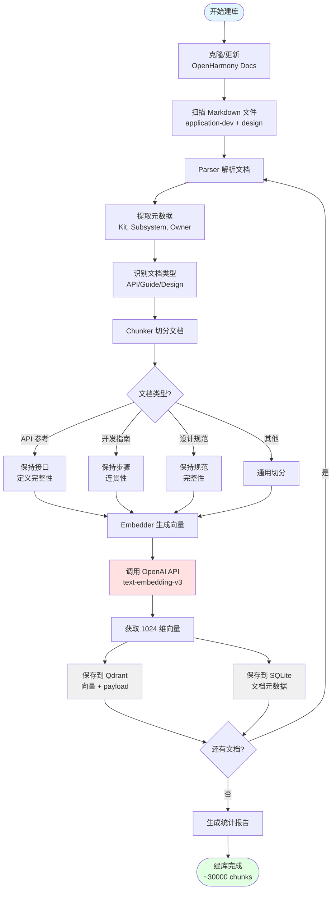
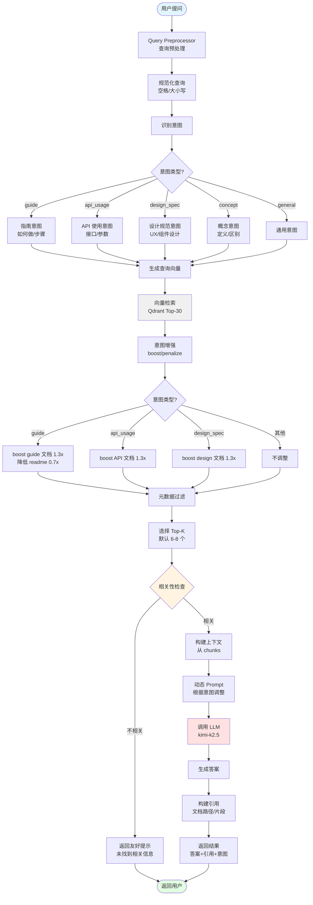
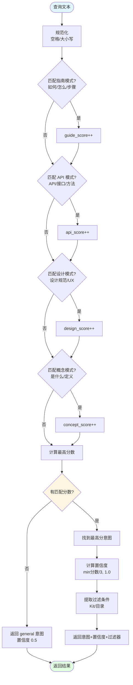
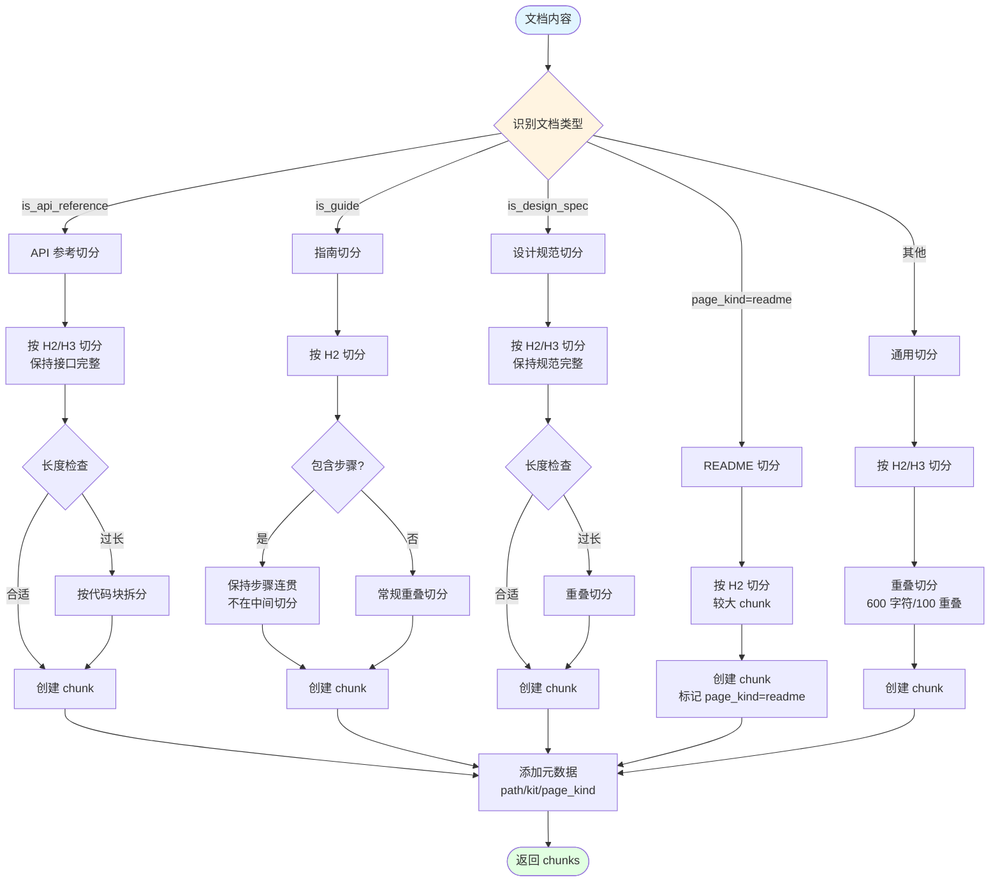

# OpenHarmony 文档 RAG 系统 - 架构图和流程图

## 系统架构图

```mermaid
graph TB
    subgraph "入口层"
        UI[Web UI]
        Skill[Skill Wrapper]
        MCP[MCP Server]
    end

    subgraph "API 层 - FastAPI"
        API[API 端点]
        Query[/query]
        Retrieve[/retrieve]
        Health[/health]
        SyncRepo[/sync-repo]
        Stats[/stats]

        API --> Query
        API --> Retrieve
        API --> Health
        API --> SyncRepo
        API --> Stats
    end

    subgraph "服务层"
        QP[Query Preprocessor<br/>意图识别]
        Retriever[Hybrid Retriever<br/>混合检索]
        AnswerService[Answer Service<br/>答案生成]
    end

    subgraph "核心层"
        Parser[Parser<br/>文档解析]
        Chunker[Chunker<br/>文档切分]
        Embedder[Embedder<br/>向量生成]
    end

    subgraph "存储层"
        Qdrant[(Qdrant<br/>向量存储<br/>30000+ chunks)]
        SQLite[(SQLite<br/>元数据存储<br/>5299 docs)]
    end

    subgraph "外部服务"
        OpenAI[OpenAI API<br/>Embedding + LLM]
        GitRepo[OpenHarmony Docs<br/>Gitee Repository]
    end

    UI --> API
    Skill --> API
    MCP --> API

    Query --> QP
    Query --> Retriever
    Query --> AnswerService

    Retrieve --> QP
    Retrieve --> Retriever

    QP --> Retriever
    Retriever --> AnswerService

    Retriever --> Qdrant
    Retriever --> SQLite

    AnswerService --> OpenAI

    SyncRepo --> GitRepo

    Parser --> Chunker
    Chunker --> Embedder
    Embedder --> OpenAI
    Embedder --> Qdrant
    Embedder --> SQLite

    style UI fill:#e1f5ff
    style Skill fill:#e1f5ff
    style MCP fill:#e1f5ff
    style API fill:#fff4e1
    style Qdrant fill:#f0f0f0
    style SQLite fill:#f0f0f0
    style OpenAI fill:#ffe1e1
```

## 离线建库流程图



## 在线问答流程图



## 意图识别流程图



## 文档类型感知切分流程图


